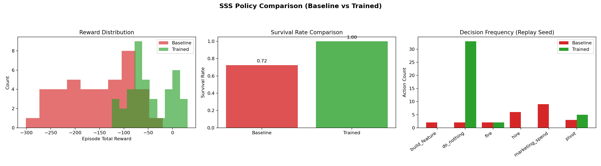

# Startup Survival Simulator

OpenEnv-compliant environment for training LLM agents to make sequential startup decisions under uncertainty (cash, growth, burn, morale, and product quality trade-offs).

## Submission Links

- Hugging Face Space: [Loosebag/SSS-Startup-Survival-Simulator](https://huggingface.co/spaces/Loosebag/SSS-Startup-Survival-Simulator)
- Colab Training Notebook (TRL + Unsloth): [train_trl.ipynb](https://colab.research.google.com/github/DivyankLosse/SSS-Startup-Survival-Simulator/blob/main/train_trl.ipynb)
- Code Repository: [DivyankLosse/SSS-Startup-Survival-Simulator](https://github.com/DivyankLosse/SSS-Startup-Survival-Simulator)
- Mini-blog / video / slides: `TODO_ADD_LINK_BEFORE_FINAL_SUBMISSION`

## Environment API

Standard environment loop:

- `POST /reset`
- `POST /step`
- `GET /state`
- `GET /tasks`
- `GET /grader?task_name=<survival|growth|scaling>`
- `GET /baseline?seed=42`

Public actions accepted by `POST /step`:

- `increase_marketing`
- `hire_engineer`
- `improve_product`
- `reduce_costs`
- `pivot_market`
- `raise_funding`
- `analyze_market`
- `refactor_code`
- `do_nothing`

Episode terminal conditions:

- `bankrupt` (cash <= 0)
- `success` (users >= 10,000)
- `timeout` (time_step >= 50)

## Training Pipeline (Hackathon Demo)

Included scripts:

- Environment (long-horizon + scenarios): `sss_hackathon_env.py`
- Reward + verifier: `sss_reward_verifier.py`
- Training loop: `sss_training.py`
- Demo/eval runner: `sss_demo.py`
- Stress/debug checks: `sss_stress_debug.py`
- Plot generation: `sss_visualize_demo.py`

Supported scenarios:

- `standard`
- `recession`
- `competition`

## Evidence of Learning

Tracked artifacts:

- `artifacts/demo_results.json`
- `artifacts/trained_policy_qtable.json`
- `artifacts/policy_comparison_plots.png`

Baseline vs trained metrics are stored in `artifacts/demo_results.json`:

- `improvement.avg_reward_lift`
- `improvement.survival_rate_lift`
- `improvement.verifier_pass_rate_lift`
- `scenario_results.recession`
- `scenario_results.competition`

Training/evaluation plot:



## Local Run

Install runtime deps:

```bash
pip install -r requirements.txt
```

Run API server:

```bash
uvicorn api:app --host 0.0.0.0 --port 7860
```

Open:

- App root: `http://localhost:7860/`
- API docs: `http://localhost:7860/docs`

Optional submission checker:

```bash
bash validate_submission.sh
```

## Training Dependencies

For Colab/GPU training only:

```bash
pip install -r requirements-training.txt
```

Or just run the provided Colab notebook (`train_trl.ipynb`) which installs TRL + Unsloth directly.

## Required Files Checklist

- `api.py`
- `env.py`
- `models.py`
- `grader.py`
- `tasks.py`
- `baseline.py`
- `inference.py`
- `interface.py`
- `openenv.yaml`
- `requirements.txt`
- `Dockerfile`

## Final Pre-Submission TODOs

- Replace `TODO_ADD_LINK_BEFORE_FINAL_SUBMISSION` with your actual mini-blog/video/slides URL.
- Confirm the linked Hugging Face Space points to the final commit.
- Re-run validation and include fresh plots if you retrain.
